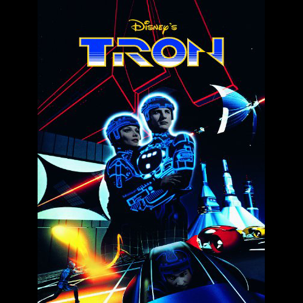
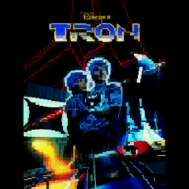
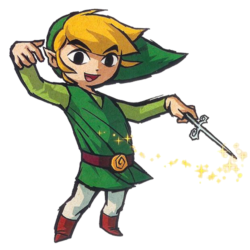
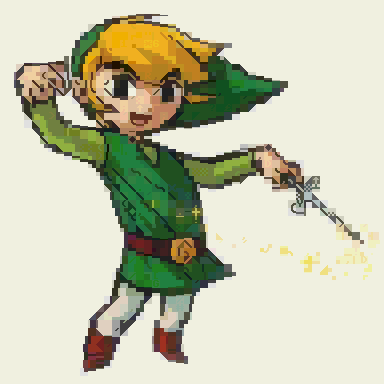
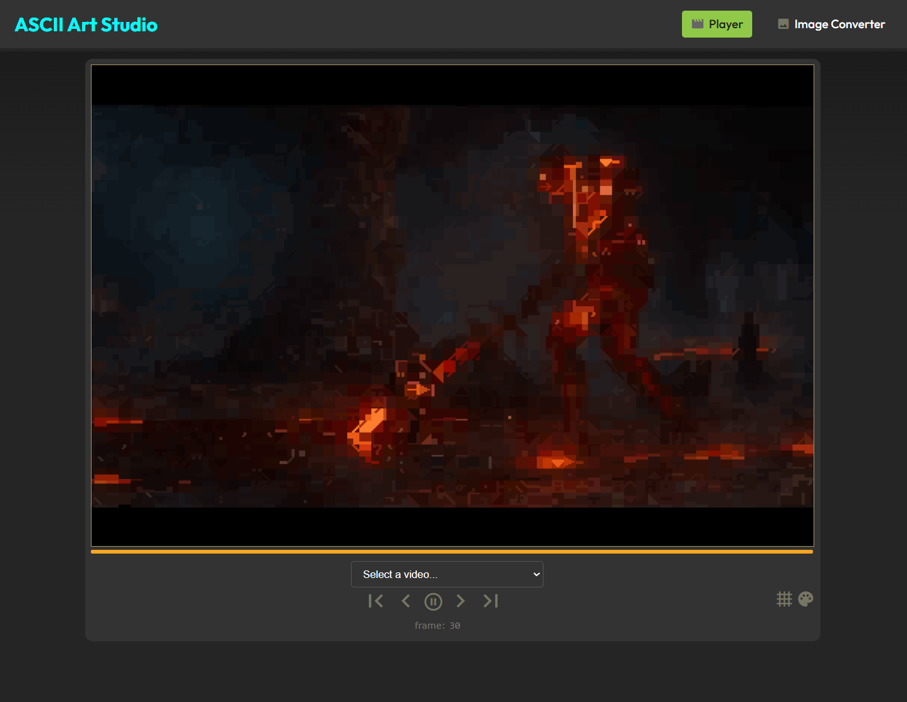
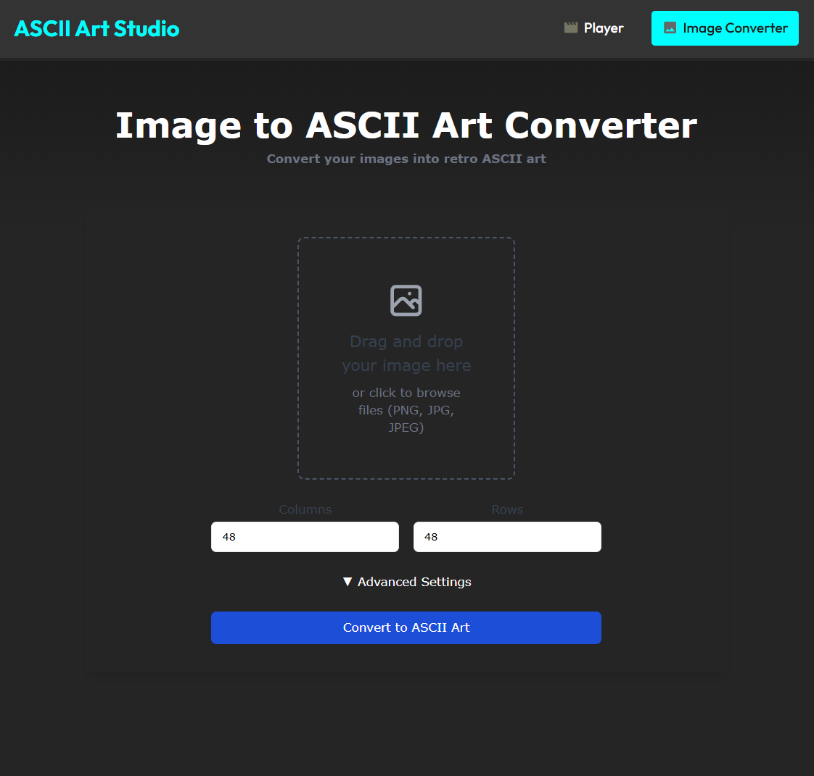

# ASCII Art Studio

A very fast and "accurate" ASCII art conversion library written in Python. The core application uses a purpose-designed PyTorch neural network, which can process images much faster than traditional solutions.

### Sample Images

|        |            |
|------------------------------------------------------------------------------|----------------------------------------------------------------------------------------|
|       |           |
|  |      |

<br>

### Screenshots

[](web/static/img/examples/web_player.png)
[](web/static/img/examples/web_converter.png)

*Click on any image to view full size*

## Features

- **Image to ASCII Conversion**: Convert any image into raster ASCII art
- **Video to ASCII Conversion**: Transform videos into animated ASCII art using a custom lightweight format
- **Multiple Character Sets**: Support for arbitrary character sets (C64, Amstrad CPC, ZX Spectrum, Atari...), including 16x8 to emulate fixed-width terminal fonts.
- **Desktop App**: Full-featured desktop video player with real-time preview and webcam input
- **Web App**: Simple web application with ASCII video player and converter
- **Neural Network Based**: Uses a custom PyTorch model for fast, high-quality ASCII conversion
- **Color Support**: Work in progress, since quantization is a whole different ball of wax. For now, the output is naively reduced to 256 colors. In the future, custom palettes will be possible, for a true retro look.
- **Customizable Output**: Adjustable character size, contrast, brightness, and number of rows and columns
- **Command line tools**: Generate training data from source images, augment and version datasets and execute training runs.

Training datasets and trained models were excluded from the repo due to file size, but all the pieces needed to generate training data and train a model with an arbitrary character set are included. You may need to tweak the network architecture in order to better fit your dataset.


## Installation

1. Clone the repository:
   ```bash
   git clone https://github.com/yourusername/ascii_movie_pytorch.git
   cd ascii_movie_pytorch
   ```

2. Create and activate a virtual environment:
   ```bash
   python -m venv venv
   source venv/bin/activate  # On Windows use `venv\Scripts\activate`
   ```

3. Install the required dependencies:
   ```bash
   pip install -r requirements.txt
   ```

## Usage

### Desktop Application

Run the desktop player:
```bash
python desktop_player.py [video_file]
```

### Web Application

Start the web server:
```bash
cd web
python app.py
```

Then open your browser and navigate to `http://localhost:8080`

### Command Line Tools

```bash
python ascii_converter.py --width --height [...]
python cpeg_converter.py
python data_analysis.py
python generate_training_data.py --shuffle --split-ratio --augment
python eval_model.py
python desktop_player.py [video / webcam] 
python console_player.py [WIP]
```

## Project Structure

- `bin/`: Command-line tools and utilities
- `datasets/`: Training datasets
- `lib/`: Core library code
- 'lib/charset/res/charsets': Character set images
- `models/`: Trained PyTorch models
- `training/`: Training scripts and utilities
- `web/`: Web application code
  - `static/`: Static files (CSS, JS, images)
  - `app.py`: Main web application


## Dependencies

- Python 3.8+
- PyTorch
- OpenCV
- NumPy
- Flask (for web interface)
- PySimpleGUI (for desktop interface)
- MoviePy (for video processing)

## Disclaimer

This project is a passion project of mine and a permanent work in progress. If you intend to run it, keep in mind that there are quite likely many broken pieces. Should you run into issues trying to make any part of it work, feel free to reach out and I will do my best to point you in the right direction. 
